 

|Opleiding:|Bachelor in de elektronica-ICT|Academiejaar:|2018 - 2019|
| :- | :- | :- | :-: |
|Klas:|2 El-ICT|Naam:|Robin Deleu|
|Groepsleden:|Deleu Robin|Groepsnummer:||
|Begeleidende docent(en):|Nele Heytens|Datum uitvoering:|6 april ’21|

|||
| -: | :- |
|o|Verslag|
|Opleidingsonderdeel:|Techniekacademie|
|Titel opdracht:|Opdracht G|

|*In te vullen door de docent*|
| :-: |
|Datum ontvangst: ||Datum evaluatie en paraaf docent:||
|Evaluatie|
|Structuur & lay-out|- -|-|=|+|++|
|Inhoud|- - |-|=|+|++|
|Taal|- -|-|=|+|++|
|Netheid|- -|-|=|+|++|

**
# Inhoud
[1.	Inleiding	 PAGEREF _Toc68619152 \h 3](#_Toc68619152)

[2.	Materiaal lijst	 PAGEREF _Toc68619153 \h 3](#_Toc68619153)

[3.	Uitgewerkt voorbeeld.	 PAGEREF _Toc68619154 \h 5](#_Toc68619154)

[3.1.	Maken van een project	 PAGEREF _Toc68619155 \h 5](#_Toc68619155)

[3.2.	Dobbelsteen	 PAGEREF _Toc68619156 \h 8](#_Toc68619156)

[3.3.	Stappenteller	 PAGEREF _Toc68619157 \h 9](#_Toc68619157)

[3.4.	Piano	 PAGEREF _Toc68619158 \h 10](#_Toc68619158)

[3.5.	Melodie	 PAGEREF _Toc68619159 \h 11](#_Toc68619159)

[3.6.	Blad, steen, schaar	 PAGEREF _Toc68619160 \h 12](#_Toc68619160)

[3.6.1.	Spelen tegen andere mensen fysiek	 PAGEREF _Toc68619161 \h 12](#_Toc68619161)

[3.6.2.	Blad, steen schaar tegen computer.	 PAGEREF _Toc68619162 \h 14](#_Toc68619162)

[4.	Documentatie	 PAGEREF _Toc68619163 \h 18](#_Toc68619163)

[5.	Figuren lijst:	 PAGEREF _Toc68619164 \h 18](#_Toc68619164)

#

# **Inleiding**
In deze opdracht is het de bedoeling waar we de kinderen van de (junior)techniekacademie laten voelen wat programmeren is en wat je er mee kan bereiken. Mijn opdracht is bedoeld voor de junior techniekacademie maar omdat ik nog nooit fysiek een groep heb begeleid heb ik niet echt voeling of dit te moeilijk of makkelijk is voor hen.
Aan de hand van het micro:bit bordje en een online code editor is het de bedoelingen dat de kinderen hun eigen programma kunnen maken. In mijn project maak ik een dobbelsteen die bij aanraking aan het logo doet alsof hij een nummer toont (willekeurig) net zoals een echte dobbelsteen. Ook kan je blad/steen/schaar spelen, hier heb je de keuze. Je kan zelf tegen een robot spelen als ze dit bijvoorbeeld thuis willen doen of dit alleen willen spelen, indien ze tegen elkaar willen spelen kan dit ook. Dan komt er blad, steen of schaar op de LED-matrix. Ook zit er een stappenteller in, aan de hand van trillingen (zoals schudden) houd hij bij hoeveel dit gebeurt. Als je dan op een knop duwt zie je op de LED-matrix terug hoeveel stappen je al gezet hebt. Voor de kinderen die meer houden van geluidjes en muziek zijn er ook enkele dingen voorzien. Onderaan aan de micro:bit zijn er 3 pinnetjes, aangeduid met 0 tem 2. Als je deze aanraakt heb ik gemaakt dat dit werkt al een “piano”. Iedere pin maakt een andere toon. Dit kan je zelf aanpassen. Tenslotte kan je ook nog een muziekje van 8 opeenvolgende noten programmeren. 

Het was mijn bedoeling om in het hele project van alles te gebruiken van drukknoppen tot sensoren. Ook zal je zien dat in mijn project ik veel verschillende lussen gebruikt heb, dit heb ik gedaan om te tonen dat alles op verschillende manieren perfect en goed kan werken. Er is namelijk geen juiste manier om aan de oplossing te komen. Door andere wegen te bewandelen kunnen de kinderen toch aan het zelfde resultaat raken.
# **Materiaal lijst**
Voor dit project heb je niet zoveel materiaal of gereedschappen nodig. Dit zijn de belangrijkste zaken dat je zeker nodig hebt:

- Micro:bit

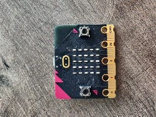

*Figuur  SEQ Figuur \\* ARABIC 1: micro:bit*

- USB kabel (micro USB B)

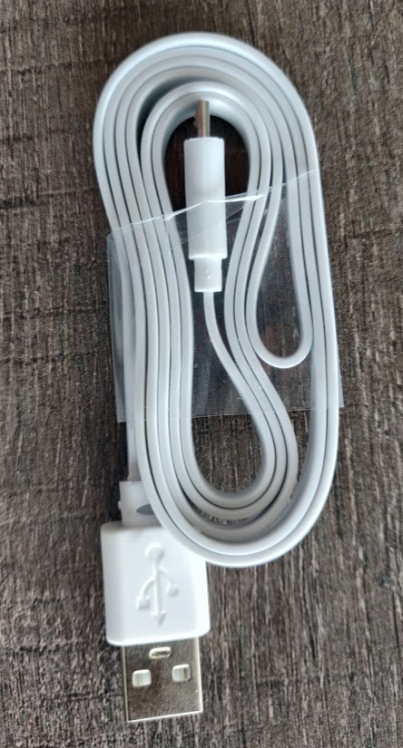

*Figuur  SEQ Figuur \\* ARABIC 2: micro USB B kabel*

- Eventueel 2 AAA batterijen en batterijhouder die geconnecteerd kan worden aan de micro:bit

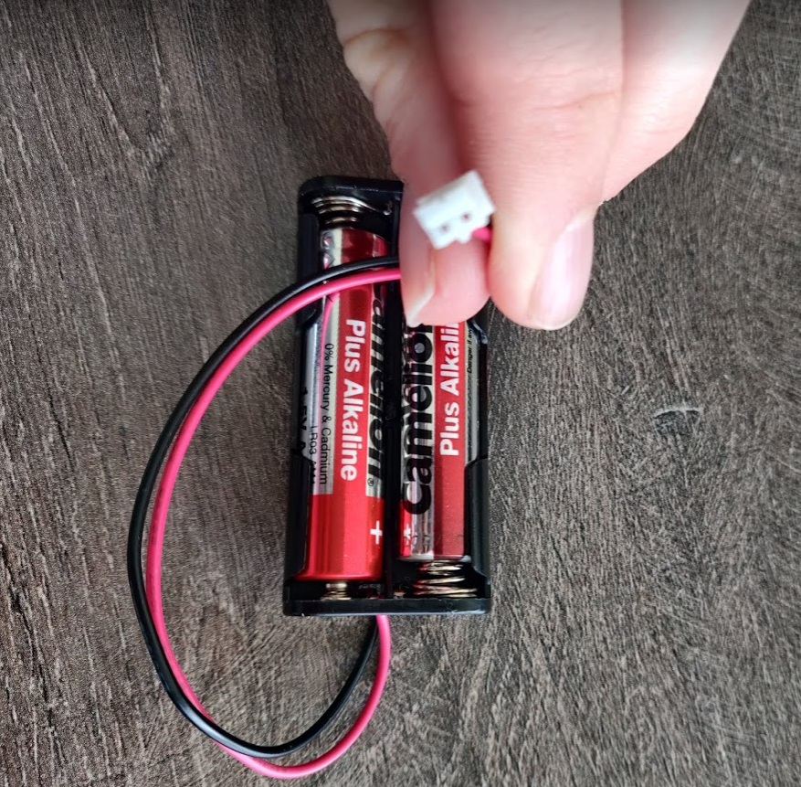

*Figuur  SEQ Figuur \\* ARABIC 3: AAA batterijen en batterijhouder*

Voor het programmeren zelf zijn er verschillende opties.

- Laptop met oplader
- Mobiel apparaat (android of ios) waar micro:bit app. (ipad of android tablet met lader)

Ook is connectiviteit zoals bekabeld of draadloos internet vereist.

# **Uitgewerkt voorbeeld.**
## **Maken van een project**
Als je wil starten met het project ga naar deze link: <https://makecode.microbit.org/> dan kom je op dit scherm terecht:

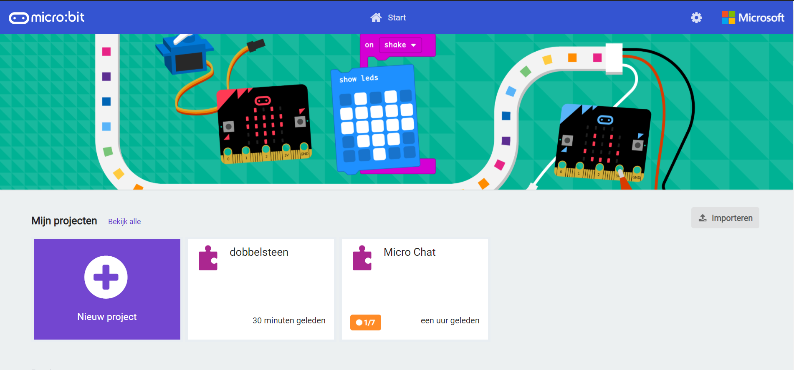

*Figuur  SEQ Figuur \\* ARABIC 4: online code editor*

Om een nieuw project te maken klik op nieuw project:

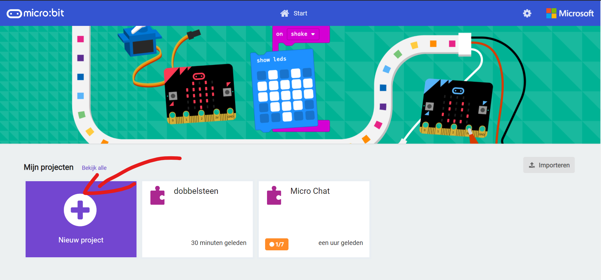

*Figuur  SEQ Figuur \\* ARABIC 5: code editor nieuw project maken*

Dan geef je je project een naam, je moet niet komen aan code opties, dit is om de programmeertalen te veranderen. Vervolgens klik je op Aanmaken.

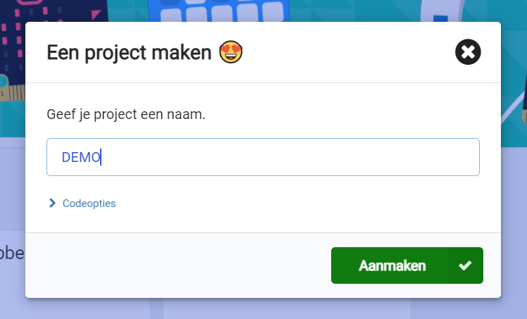

*Figuur  SEQ Figuur \\* ARABIC 6: nieuw project aanmaken naam*

Na dat je op Aanmaken klikt kom je uit op de code editor die we zullen gebruiken, namelijk een soort van scratch variant, programmeren aan de hand van code blokjes.

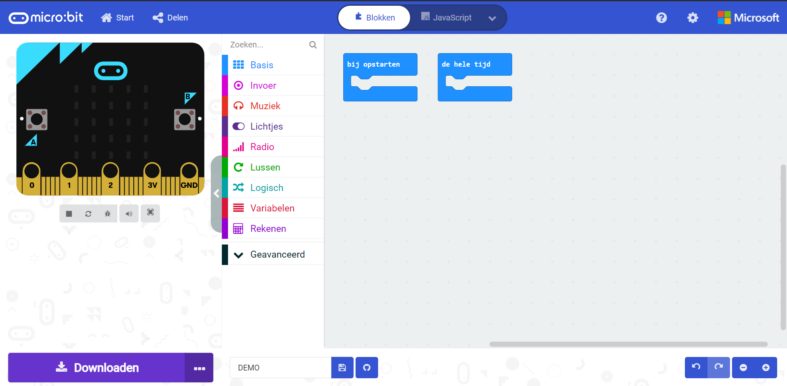

*Figuur  SEQ Figuur \\* ARABIC 7: startscherm online editor*

Om ervoor te zorgen dat je micro:bit verbonden is met het apparaat waarmee je werk, voor laptop of computer via USB kabel, mobiele apparaten kan je dit doen via bluetooth. Eerst klink je beneden op de 3 bolletjes, dan op apparaat koppelen. Daarna kan je je apparaat vinden uit een lijst met verbonden apparaten en klink je op verbinden.

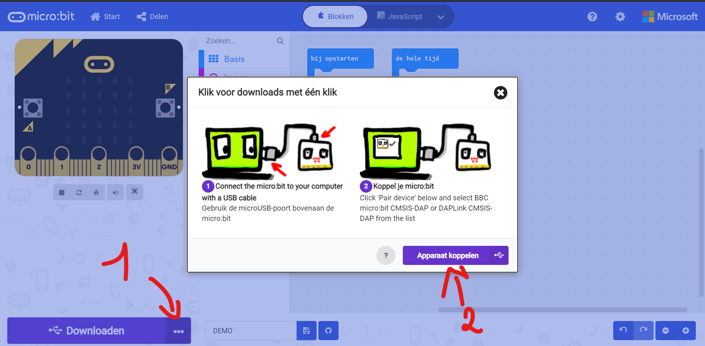

*Figuur  SEQ Figuur \\* ARABIC 8: USB apparaat koppelen*

Om je code op je micro:bit te plaatsen druk je op downloaden en hij zal dan via USB automatisch de micro:bit flashen.

## **Dobbelsteen**
De bedoeling is dat bij het aanraken van het logo op de LED-Matrix een getal komt. Dit is willekeurig zodat dit net is alsof je met de dobbelsteen zou smijten.

Eerst nemen we een invoerblokje, dit kan je link vinden bij invoer, daar scroll je bijna helemaal naar beneden naar bij logo aangeraakt, dit sleep je naar binnen. Dit is een blokje code die zal worden uitgevoerd als je het logo aanraakt. Dan klikken we op basis, daar nemen we wis scherm blokje uit. Dit doe ik om er zeker voor te zijn als ik het nummer wil tonen het scherm leeg is. Daarna vind je ook bij basis het blokje toon nummer “0”. Die sleep je er onder. Bij rekenen vind je het blokje kies willekeurig “0” tot “10”. Deze sleep je in het blokje toon nummer. Het enige die we nog moeten veranderen is bij willekeurig de waarden. We kiezen “1” tot “6”. Dit doen we om het stukje code de zelfde waarden te doen tonen net als een echte dobbelsteen.
Kort uitgelegd deze code zal bij het aanraken van het logo zorgen dat het schermpje leeg is, daarna zal hij een willekeurig getal tonen tussen 1 en 6.
Dit deel projectje is denk ik eenvoudig voor de hele groep.

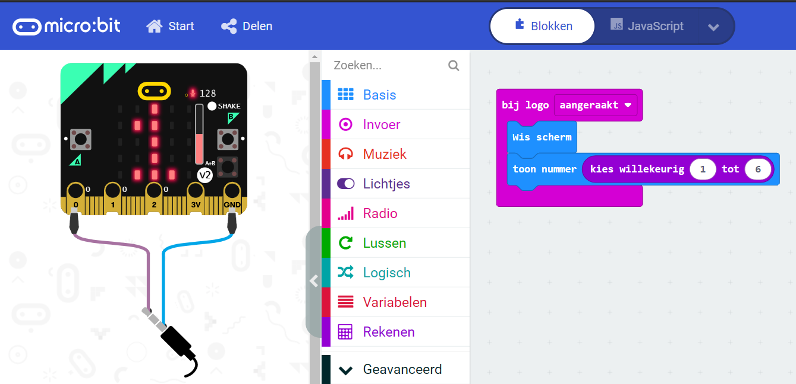

*Figuur  SEQ Figuur \\* ARABIC 9: code dobbelsteen*

## ` `**Stappenteller**
Omdat het leuk is voor de kinderen om meer dan 1 projectje te hebben op 1 micro:bit bordje volgen er nog stukjes die simultaan te gebruiken zijn.
De volgende is een stappenteller, de bedoeling is dat als de micro:bit in de boekentas zit of in hun broekzakken dat hij bijhoud hoeveel stappen ze ongeveer zetten, als er op een knop geduwd word zal je kunnen zien hoeveel stappen ze gezet hebben.

Eerst nemen we bij Basis het blokje opstarten (bij het aanmaken van een project staat deze normaal standaard op het scherm). Hierin kan je code zetten die uitgevoerd zal worden bij het opstarten van het bordje. Hier is het belangrijk dat we een variabele aanmaken en op 0 zetten.
Dit doen we door bij het rode vakje links naar variabelen te gaan. Daar maken we de variabele Stappen aan. Dan slepen we het vakje stel Stappen in op 0 terug. Als je naar mijn code voorbeeld zal kijken zal je merken dat er nog heel wat extra info bijstaat, dit is voor de kinderen ook leuk om te doen, hier kunnen ze creatief geluidjes toevoegen, figuurtjes maken op het schermpje, hun naam laten zeggen, … Dit maakt de beleving met de micro:bit leuker en persoonlijker.
Vervolgens nemen we uit het balkje links het codeblokje bij schudden. Dit zal iedere keer aangeroepen worden iedere keer de sensor achteraan de micro:bit voelt dat hij geschud word. Daar plaatsen we het blokje verander stappen met 1 in. Iedere keer geschud word zal de variabele incrementeren met 1.
Om er voor te zorgen dat we onze stappen kunnen zien nemen we uit invoer het code blok wanneer knop A wordt ingedrukt. Hierin plaatsen we net zoals de dobbelsteen wis scherm en toon nummer blok. Het enige wat hier veranderd is dat nummer 0 vervangen word door Stappen.

Kort samengevat, bij het opstarten maken we een variabele aan die op 0 staat (0 stappen). Bij het bewegen zal hij het aantal stappen bijhouden. Als je op de A knop duwt toont hij op het schermpje het aantal stappen.

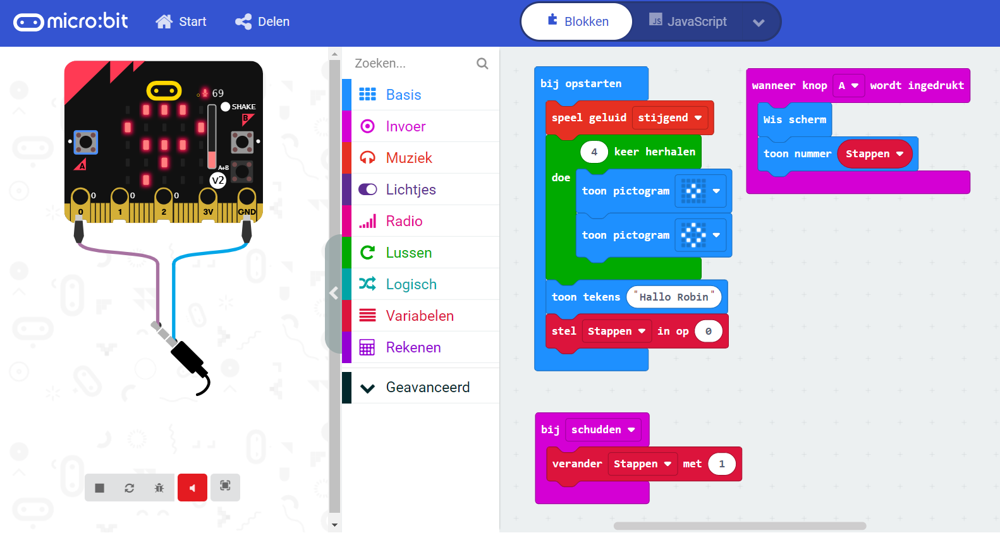

*Figuur  SEQ Figuur \\* ARABIC 10: code stappenteller*

## ` `**Piano**
In dit deel projectje zullen we op de pinnen vanonder aan het bordje een soort pianootje maken. 
Dit programmeren is niet zo super moeilijk, maar het laat wel toe dat de kinderen creatief kunnen zijn in het maken of bespelen ervan.

Om te beginnen hier ga je naar invoer en zoek je naar wanneer ping “P0” wordt aangeraakt. Daarna ga je naar muziek. Hier kan je het blokje speel toon Middel C voor 1 beat terugvinden. Dit doe je analoog voor pin P1 en P2.

Hier kunnen ze de toon aanpassen van C (do) naar de noten dat ze willen, de duur kunnen ze ook aanpassen. Ook kunnen ze andere muziekblokjes gebruiken.

Kort samengevat bij het aanraken van een pin wordt er een klank die voorgeprogrammeerd is gereproduceerd.

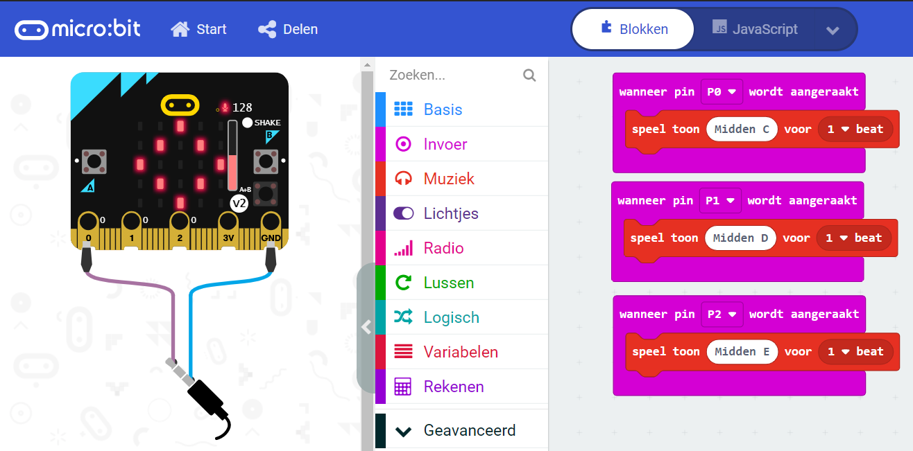

*Figuur  SEQ Figuur \\* ARABIC 11: code piano*

## ` `**Melodie**

*Figuur  SEQ Figuur \\* ARABIC 12: melodie editor*

*Figuur  SEQ Figuur \\* ARABIC 12: melodie editor*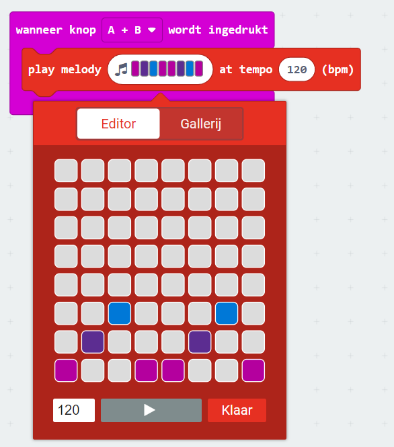De piano is leuk omdat je aan de hand van eigen ingeving van het moment een muziekje kan spelen, op het tempo dat je zelf wilt, met de noten die je voor handen hebt maar je kan zelf eindeloos combineren. In dit deel programmatje zal je op voorhand een muziekstukje kunnen maken en deze laten afspelen als je knop A en B tegelijkertijd indrukt. 

Hiervoor hebben we het codeblokje wanneer knop A wordt ingedrukt nodig. We veranderen hier A naar A+B dit kan je doen door op het pijltje naast A te drukken. Via muziek (links) kan je het blokje play melody at temp 120 bpm vinden. Als je op de muzieknoten duwt kan je de muziek noten aanpassen. Iedere tegel stelt een noot voor, hoe lager het vakje, hoe lager de toon. Iedere verticale lijn blokjes stelt een nieuwe tel aan in de muziek. Links onder vind je 120, dit is de snelheid van het liedje. Als je op de play knop drukt hoor je de geprogrammeerde melodie. 

Kort samengevat kan je een muziekje dat je zelf gemaakt hebt laten afspelen op je bordje als je de 2 koppen indrukt.

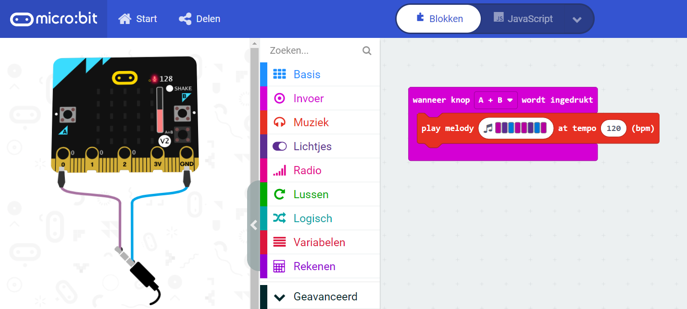

*Figuur  SEQ Figuur \\* ARABIC 13: code melodie*

## ` `**Blad, steen, schaar**
## **Spelen tegen andere mensen fysiek**
Hier is het de bedoeling om samen met een ander vriendje blad steen schaar te kunnen spelen via de micro:bit. Hier activeren we het spelletje door te klappen.

Dit deel code is iets complexer dan het voorgaande omdat de code wat langer is en ook iets meer na moet worden gedacht. We beginnen met een codeblokje te nemen uit uitvoer: bij luid geluid. Deze code blok word uitgevoerd als er heel veel geluid is zoals klappen in de handen of fluiten,…
Uit voorzorg wissen we het scherm zoals in de voorgaande projectjes, dit blokje vind je bij basis.
Net zoals bij de stappenteller maken we een variabele aan. Deze kan je vinden links bij variabele, we kiezen voor het blokje stel BST-Manual in op 0.
Omdat we willen dat blad steen schaar eerlijk verloopt en niet te voorpellen willen we het willekeurig maken, dit hebben we al toegepast bij de dobbelsteen. We vinden het blokje kies willekeurig 0 tot 10 terug bij rekenen. Bij blad steen schaar hebben we 3 toestanden: Blad in code stellen we dit voor als een 1, steen stellen we voor als 2 en ten slotte schaar stellen we voor als 3. Bij het stukje code kies willekeurig 0 tot 10 veranderen we 0 door 1 en 10 naar 3. Dit doen we om 3 willekeurige getallen te krijgen: 1, 2 en 3.

Daarna maken we lusjes of loops in het Engels. Dit is een blokje code die niet altijd zal werken of gebruikt worden. Alles hangt af van de voorwaarde die je er zelf aan vast hangt. In dit voorbeeld gebruik ik een terwijl doe loop ( do while loop) maar dit kan perfect met als loop (if loop). Ik zal bij het volgende project de if loop demonstreren zodat beide loops aan bod zullen komen. We maken 3 lussen, deze vinden we bij lussen. We nemen de terwijl doe lus. Als standaard voorwaarde staat normaal waar, dit vervangen we door een vergelijking, dit vind je terug bij logisch, daar vullen we in dat we vergelijken met BST-Manual en een voorgegeven waarde 1, 2 en 3. Voor lus 1 zeggen we BST-manual = 1 ?, voor de 2de BST-manual = 2 en tenslotte voor de laatste lus is BST-manual = 3. Dit is heel veel info na elkaar, onder deze beschrijving vind je een foto van de code die ik beschrijf, kijk gerust na hoe ik het gedaan heb.

In iedere lus zetten we dezelfde code blokjes, namelijk het blokje toon tekens “HELLO !”, wis scherm en tenslotte stel BST-manual in op 0. Waarom deze blokjes kom ik straks op terug.

In iedere lus veranderen we tekens HELLO ! naar hun waarde, bij BST-manual = 1 willen we hebben dat hij blad toont, bij BST-manual = 2 zouden we graag steen zien en tenslotte bij BST-manual = 3 willen we graag schaar hebben.

In de lussen zien we een blokje stel BST-manual in op 0. Dit zullen veel kinderen denk ik initieel vergeten. Omdat we een doe terwijl lus gebruiken kijkt hij altijd naar de voorwaarde zoals BST-manual = 1. Hij blijft deze code uitvoeren voor zolang de voorwaarde klopt. Als we de variabele laten blijven staan op 1 zal hij oneindig vast zitten in dit deeltje code. Door BST-manual te veranderen naar 0 zal hij uit deze lus raken en de andere lussen van steen en schaar niet betreden.

Kort samengevat als je in je handen klapt zal een willekeurig getal beslissen of je blad, steen of schaar hebt. Deze info toont hij op het schermpje, als je dit samen wil spelen met iemand anders kan dit eenvoudig omdat je klapt starten bij beide mensen op zelfde moment het spelletje.

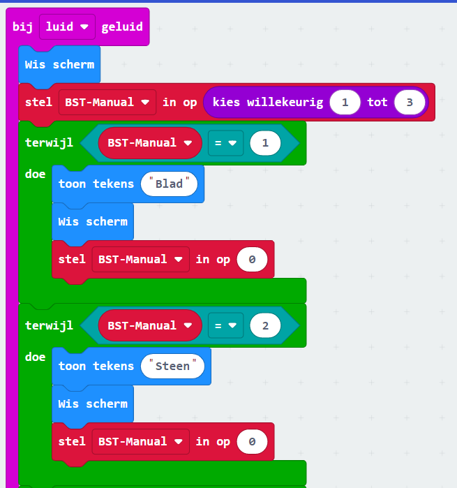
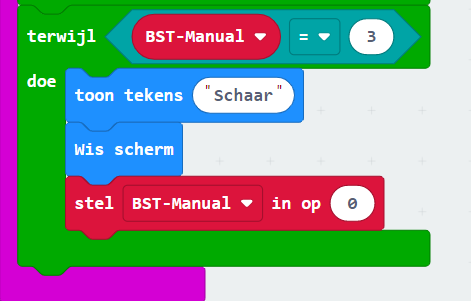

*Figuur  SEQ Figuur \\* ARABIC 14: code blad, steen, schaar manueel*

## **Blad, steen schaar tegen computer.**
Dit is echt een moeilijk deel in het project. Niet iedereen zal hier raken maar dit kan je houden voor de kinderen die vlot mee zijn of iets meer uitdaging willen. De bedoeling van dit project is dat je blad, steen, schaar kan spelen tegen de computer door het drukken op de knop. Het resultaat van het spelletje komt op je LED-matrix schermpje.

We starten dit project door het code blokje wanneer knop A wordt ingedrukt. Knop A veranderen we door knop B.

Vervolgens nemen we uit basis het blokje wis scherm.

Daarna nemen we 2 blokjes uit variabele, namelijk stel BST in op 0 en stel Computerbst in op 0 (let op, je moet de variabelen aanmaken vooraleer je deze kan gebruiken).

Uit het deeltje rekenen vind je zoals bij andere projectjes kies willekeurig … tot …, hier willen we net zoals bij de andere blad steen schaar tussen 1 en 3 kiezen. We gebruiken de zelfde logica, 1 is blad, 2 is steen en 3 is schaar.

Nu hebben we 2 variabelen met een willekeurige waarde BST en Computerbst, ze kunnen beiden een waarde hebben van 1 tot 3. Wat wil zeggen tijdens blad steen schaar er 9 verschillende mogelijkheden zijn.

Tijdens het maken van de lussen is het belangrijk dat de kinderen iedere toestand beschrijven in hun code.

Bij vorig project had ik gebruikt ik een doe terwijl lust (do while), nu maak ik gebruik van een als lus (if loop). Hier zeg je als VARIABE = bepaalde waarde waar is dan word het codeblok uitgevoerd.

Hier maken we 3 als lussen, als BST = 1, BST = 2 en BST = 3. 
De als lussen vind je bij lussen, daarna vind je bij logisch de vergelijkingen. Dan moet je nog de variabele naam er in slepen ter vollediging. 

In deze lussen maken we nog eens 3 als lussen. Dus per als lus hebben we 3 lussen er in.
In deze sublussen controleren we op Computerbst. Net zoals bij BST kijken we of deze gelijk zijn aan 1,2 of 3. In deze lussen zetten we het code blokje toon tekens, hier zetten we gewonnen, gelijk of verloren afhankelijk of blad, steen of schaar wint van de computer. Daarna gebruiken het code blokje wis scherm om zeker van te zijn dat de inhoud van voorgaande projectjes van het scherm is. In het tabelletje hieronder kan je zien of je gewonnen, verloren of gelijk moet gebruiken.

|Waarde|BST| |Computer BST|waarde|
| :- | :- | :- | :- | :- |
|1|Blad|gelijk|Blad|1|
|1|Blad|gewonnen|Steen|2|
|1|Blad|verloren|Schaar|3|
|2|Steen|verloren|Blad|1|
|2|Steen|gelijk|Steen|2|
|2|Steen|gewonnen|Schaar|3|
|3|Schaar|gewonnen|Blad|1|
|3|Schaar|verloren|Steen|2|
|3|Schaar|gelijk|Schaar|3|
*Figuur  SEQ Figuur \\* ARABIC 15: waarheidstabel blad, steen, schaar*

Kort samengevat duw je op knop B, intern zullen 2 variabelen kiezen of je zelf blad, steen of schaar hebt. Maar ook de computer maakt willekeurig een keuze. De lussen zullen kijken wie er wint en zal tonen op het scherm of jij gewonnen hebt, verloren hebt of gelijk gespeelt hebt tegen de computer.

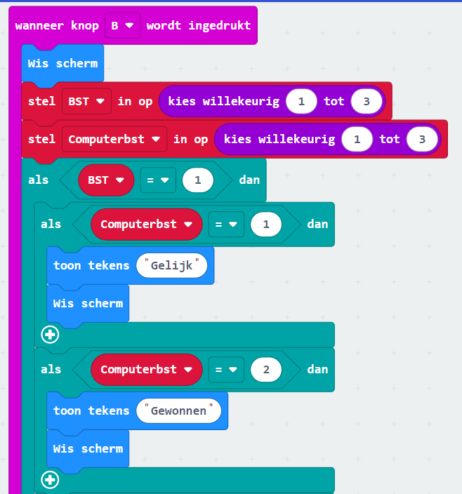 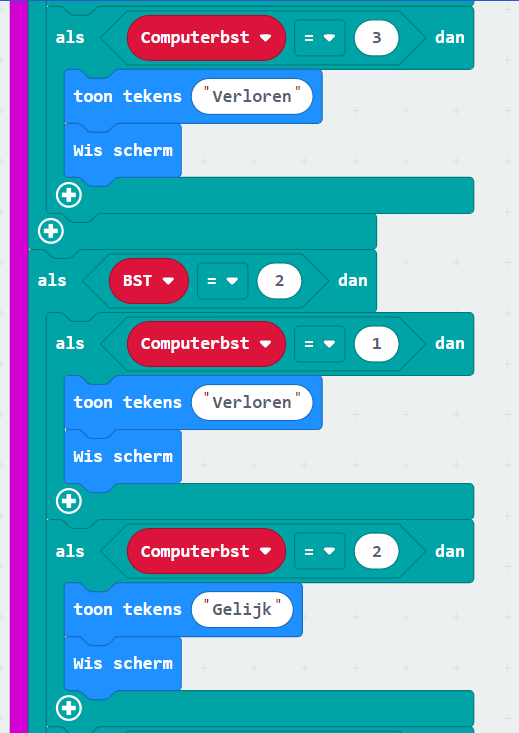 
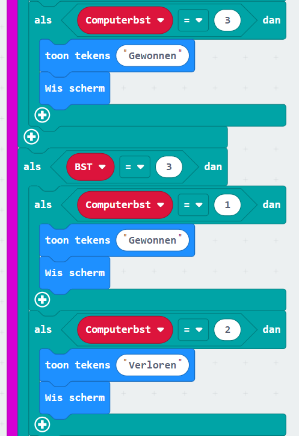
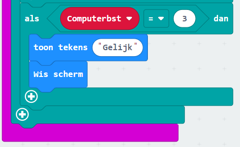

*Figuur  SEQ Figuur \\* ARABIC 16: code blad, steen, schaar computer*

# **Documentatie**
Meer info of code kan je vinden op mijn GitHub profiel (<https://github.com/robindeleu/techniekacademie>), hier kan je de javascript code vinden of python code als iemand niet met de blokken code zou werken. Ook zal je daar de .hex file vinden. Als je deze download en dan kopieert op de micro:bit via de windows verkenner zal hij het programma laden op het bordje en zal je mijn demo kunnen gebruiken.
# **Figuren lijst:**
` `TOC \h \z \c "Figuur" [Figuur 1: micro:bit	 PAGEREF _Toc68619087 \h 3](#_Toc68619087)

[Figuur 2: micro USB B kabel	 PAGEREF _Toc68619088 \h 4](#_Toc68619088)

[Figuur 3: AAA batterijen en batterijhouder	 PAGEREF _Toc68619089 \h 4](#_Toc68619089)

[Figuur 4: online code editor	 PAGEREF _Toc68619090 \h 5](#_Toc68619090)

[Figuur 5: code editor nieuw project maken	 PAGEREF _Toc68619091 \h 5](#_Toc68619091)

[Figuur 6: nieuw project aanmaken naam	 PAGEREF _Toc68619092 \h 6](#_Toc68619092)

[Figuur 7: startscherm online editor	 PAGEREF _Toc68619093 \h 6](#_Toc68619093)

[Figuur 8: USB apparaat koppelen	 PAGEREF _Toc68619094 \h 7](#_Toc68619094)

[Figuur 9: code dobbelsteen	 PAGEREF _Toc68619095 \h 8](#_Toc68619095)

[Figuur 10: code stappenteller	 PAGEREF _Toc68619096 \h 9](#_Toc68619096)

[Figuur 11: code piano	 PAGEREF _Toc68619097 \h 10](#_Toc68619097)

[Figuur 12: melodie editor	 PAGEREF _Toc68619098 \h 11](D:\Users\deleu\Documents\VIVES\Techniekacademie\opdracht-G.docx#_Toc68619098)

[Figuur 13: code melodie	 PAGEREF _Toc68619099 \h 11](#_Toc68619099)

[Figuur 14: code blad, steen, schaar manueel	 PAGEREF _Toc68619100 \h 13](#_Toc68619100)

[Figuur 15: waarheidstabel blad, steen, schaar	 PAGEREF _Toc68619101 \h 15](#_Toc68619101)

[Figuur 16: code blad, steen, schaar computer	 PAGEREF _Toc68619102 \h 17](#_Toc68619102)
#

` `**KATHOLIEKE HOGESCHOOL VIVES** – **STUDIEGEBIED IW&T** – **CAMPUS BRUGGE**	PAGE   \\* MERGEFORMAT18

